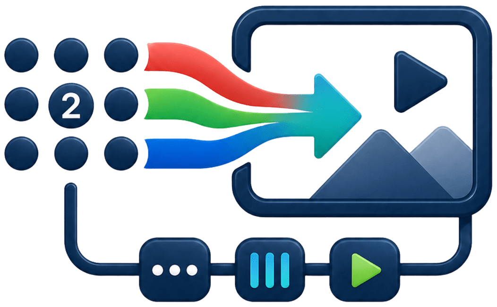
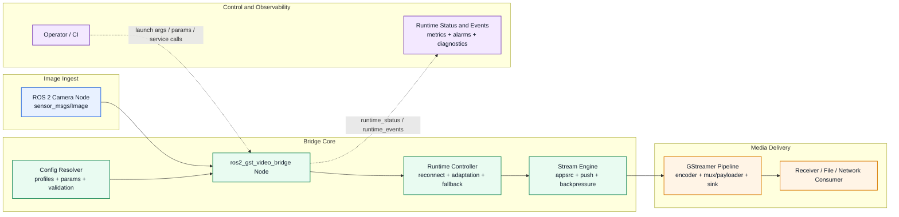
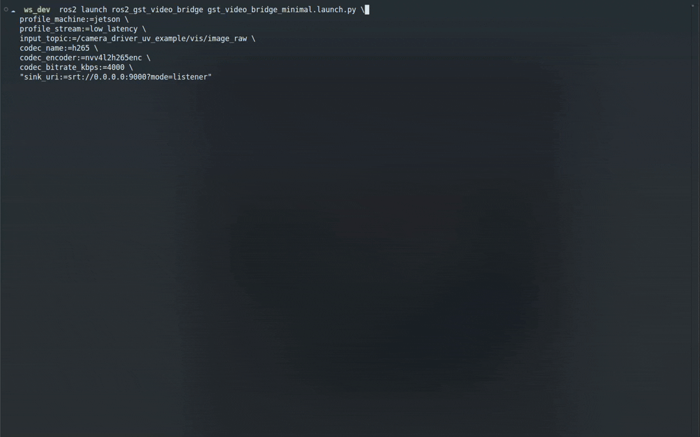
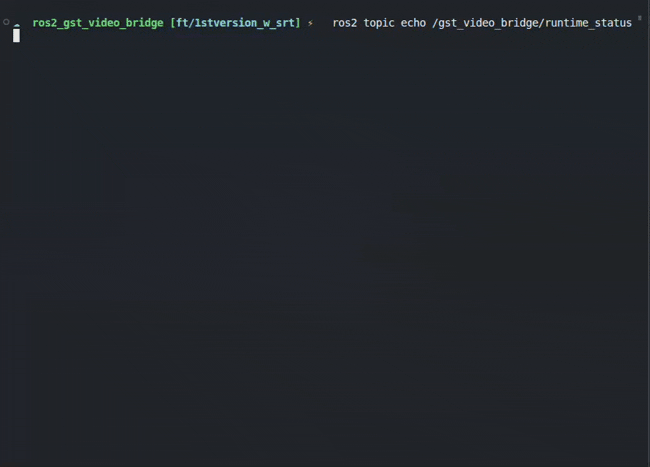

# ros2_gst_video_bridge

[](https://opensource.org/licenses/AGPL-3.0) [](https://github.com/mkassimi98/ros2_gst_video_bridge) [](https://docs.ros.org/en/humble/) []() [](https://www.python.org/)

<p align="center">
  
</p>
<p align="center"><em>ros2_gst_video_bridge</em></p>

## Overview

**ros2_gst_video_bridge** is a ROS 2 node that subscribes to raw image streams (`sensor_msgs/Image`) and forwards frames through configurable GStreamer pipelines for flexible video transport and codec handling. It supports multiple output protocols (SRT, RTSP, RTP/UDP, file), codec selection with automatic hardware acceleration fallback, and production-grade resilience features (reconnection, backpressure handling, adaptation).

### Architecture at a Glance



For deeper internals and runtime behavior, see [docs/ARCHITECTURE.md](docs/ARCHITECTURE.md).

### Key Features

- **Transport agnostic**: SRT, RTSP, RTP/UDP, file, and custom GStreamer sinks
- **Smart codec selection**: Auto-detection of hardware and software encoders with fallback
- **Resilient streaming**: Automatic reconnection, backpressure handling, and adaptive bitrate control
- **Jetson-optimized**: NVIDIA hardware encoder support with graceful CPU fallback
- **Runtime diagnostics**: Rich observability via typed ROS topics and services
- **Profile-based configuration**: Curated presets for Jetson, x86, and Raspberry Pi

## Quick Start

### 1. Install Dependencies

```bash
sudo apt-get update && sudo apt-get install -y \
  gstreamer1.0-tools \
  gstreamer1.0-plugins-base \
  gstreamer1.0-plugins-good \
  gstreamer1.0-plugins-bad \
  gstreamer1.0-libav \
  libgstreamer1.0-dev \
  libgstreamer-plugins-base1.0-dev
```

### 2. Build

```bash
cd ~/ros2_ws/src
git clone <repo-url> ros2_gst_video_bridge
cd ~/ros2_ws
rosdep install --from-paths src --ignore-src -r -y
colcon build --packages-up-to ros2_gst_video_bridge
source install/setup.bash
```

### 3. Run

Minimal SRT streaming with automatic codec selection:

```bash
ros2 launch ros2_gst_video_bridge gst_video_bridge_minimal.launch.py \
  input_topic:=/camera/image_raw \
  "sink_uri:=srt://0.0.0.0:9000?mode=listener"
```

Jetson with H.265 hardware encoding:

```bash
ros2 launch ros2_gst_video_bridge gst_video_bridge_minimal.launch.py \
  profile_machine:=jetson \
  profile_stream:=low_latency \
  input_topic:=/camera/image_raw \
  codec_name:=h265 \
  codec_encoder:=nvv4l2h265enc \
  "sink_uri:=srt://0.0.0.0:9000?mode=listener"
```

## Live Demos

### Demo 1: Launch bridge node (Jetson + H.265 + SRT listener)

Command used:

```bash
ros2 launch ros2_gst_video_bridge gst_video_bridge_minimal.launch.py \
  profile_machine:=jetson \
  profile_stream:=low_latency \
  input_topic:=/camera_driver_uv_example/vis/image_raw \
  codec_name:=h265 \
  codec_encoder:=nvv4l2h265enc \
  codec_bitrate_kbps:=4000 \
  "sink_uri:=srt://0.0.0.0:9000?mode=listener"
```

<p align="center">
  
</p>

### Demo 2: Runtime status monitoring

Command used:

```bash
ros2 topic echo /gst_video_bridge/runtime_status
```

<p align="center">
  
</p>

## Documentation

Complete documentation is available in the `docs/` directory:

| Document | Purpose |
|----------|---------|
| **[docs/INDEX.md](docs/INDEX.md)** | Documentation hub with reading paths |
| **[docs/ARCHITECTURE.md](docs/ARCHITECTURE.md)** | System architecture and design rationale |
| **[docs/LAUNCH.md](docs/LAUNCH.md)** | Launch arguments and parameter reference |
| **[docs/CONTROL_PLANE.md](docs/CONTROL_PLANE.md)** | Runtime API (topics/services) contract |
| **[docs/TROUBLESHOOTING.md](docs/TROUBLESHOOTING.md)** | Operational diagnostics and recovery |
| **[docs/DEPENDENCIES.md](docs/DEPENDENCIES.md)** | System package requirements |
| **[docs/PLATFORM_MATRIX.md](docs/PLATFORM_MATRIX.md)** | Tested hardware/OS combinations |
| **[CONTRIBUTING.md](CONTRIBUTING.md)** | Development guidelines |
| **[AUTHORS.md](AUTHORS.md)** | Project authors and contributors |

## Parameter Reference

All parameters are declared at node startup. Modern namespaced names take precedence over legacy `gst.*` aliases.

### Profile Configuration

| Parameter | Type | Default | Description |
|-----------|------|---------|-------------|
| `profile.machine` | string | `generic` | Machine class: `generic`, `jetson`, `x86`, `raspi` |
| `profile.stream` | string | `default` | Stream profile: `default`, `low_latency`, `low_bandwidth`, `high_quality`, `monitoring_udp` |

### Source

| Parameter | Type | Default | Description |
|-----------|------|---------|-------------|
| `input_topic` | string | `/camera/image_raw` | ROS 2 image topic (`sensor_msgs/msg/Image`) |

### Transport

| Parameter | Type | Default | Description |
|-----------|------|---------|-------------|
| `transport.kind` | string | `srt` | Protocol: `srt`, `rtsp`, `udp`, `file` |
| `transport.sink_uri` | string | `srt://127.0.0.1:9000?mode=listener` | Destination URI for the selected sink |
| `transport.latency_ms` | int | `60` | SRT latency in milliseconds |
| `transport.reconnect.enabled` | bool | `true` | Enable automatic reconnection |
| `transport.reconnect.interval_ms` | int | `1000` | Minimum time between reconnect attempts (ms) |
| `transport.reconnect.max_attempts` | int | `0` | Max attempts; `0` = unlimited |

### Codec & Encoding

| Parameter | Type | Default | Description |
|-----------|------|---------|-------------|
| `codec.name` | string | `auto` | Codec: `auto`, `av1`, `h265`, `h264`, `mjpeg` |
| `codec.encoder` | string | `` | GStreamer encoder element (empty = auto-select) |
| `codec.profile` | string | `baseline` | H.264/H.265 profile (`baseline`, `main`, `high`) |
| `codec.tune` | string | `zerolatency` | Encoder tuning (`zerolatency`, `fastdecode`, etc.) |
| `codec.rate_control` | string | `cbr` | Rate control mode: `cbr` or `vbr` |
| `codec.bitrate_kbps` | int | `2000` | Target bitrate in kbps |
| `codec.gop` | int | `30` | Keyframe interval (frames) |

### Runtime Behavior

| Parameter | Type | Default | Description |
|-----------|------|---------|-------------|
| `max_fps` | double | `30.0` | Maximum FPS forwarded to GStreamer |
| `use_wall_clock_timestamps` | bool | `false` | Use node clock instead of image timestamp |
| `runtime.mode` | string | `stream` | Mode: `stream`, `list_topics`, `list_capabilities`, `validate_config`, `discover` |
| `runtime.print_effective_config` | bool | `true` | Log resolved configuration at startup |
| `runtime.backpressure.reconnect_after_ms` | int | `2000` | Reconnect if backpressure sustained for this long (ms) |
| `runtime.backpressure.max_consecutive_drops` | int | `60` | Reconnect after this many consecutive backpressure drops |
| `runtime.stream_id` | string | `default` | Stream identifier for logs and status topics |
| `runtime.hw_fallback_failures` | int | `3` | Failed attempts before falling back to software encoder |

### Adaptive Resilience

| Parameter | Type | Default | Description |
|-----------|------|---------|-------------|
| `runtime.adaptation.enabled` | bool | `true` | Enable automatic bitrate/FPS/GOP adaptation |
| `runtime.adaptation.profile` | string | `balanced` | Aggressiveness: `conservative`, `balanced`, `aggressive` |
| `runtime.adaptation.interval_ms` | int | `2000` | Min interval between adaptation steps (ms) |
| `runtime.adaptation.cooldown_ms` | int | `5000` | Cooldown before recovering quality (ms) |

**Full parameter documentation**: see [docs/LAUNCH.md](docs/LAUNCH.md)

## Repository Structure

```
ros2_gst_video_bridge/
├── ros2_gst_video_bridge/              # Node implementation
│   ├── config/                         # Default profiles and YAML templates
│   ├── include/ros2_gst_video_bridge/  # Public headers
│   ├── launch/                         # ROS 2 launch files
│   ├── scripts/                        # Validation and soak test scripts
│   ├── src/                            # Implementation
│   ├── test/                           # Unit and integration tests
│   ├── CMakeLists.txt
│   └── package.xml
├── ros2_gst_video_bridge_msgs/         # Typed interfaces (topics/services)
│   ├── msg/
│   ├── srv/
│   ├── CMakeLists.txt
│   └── package.xml
├── docs/                               # Complete documentation
├── AUTHORS.md                          # Project authors
├── CHANGELOG.md                        # Release history
├── CONTRIBUTING.md                     # Development guidelines
├── LICENSE                             # AGPL-3.0
└── README.md                           # This file
```

## Supported Platforms

| ROS Distribution | Ubuntu | Jetson | Status |
|------------------|--------|--------|--------|
| **Humble** | 22.04 | JetPack 5.x | ✓ Tested |
| Iron/Jazzy | 22.04+ | - | ⧗ Not validated |

See [docs/PLATFORM_MATRIX.md](docs/PLATFORM_MATRIX.md) for detailed hardware compatibility.

## Common Use Cases

### 1. Jetson Low-Latency H.265 SRT

```bash
ros2 launch ros2_gst_video_bridge gst_video_bridge_minimal.launch.py \
  profile_machine:=jetson \
  profile_stream:=low_latency \
  codec_name:=h265 \
  codec_encoder:=nvv4l2h265enc \
  codec_bitrate_kbps:=4000 \
  "sink_uri:=srt://receiver.local:9000?mode=listener"
```

### 2. x86 Software H.264 Monitoring

```bash
ros2 launch ros2_gst_video_bridge gst_video_bridge_minimal.launch.py \
  profile_machine:=x86 \
  codec_name:=h264 \
  codec_encoder:=x264enc \
  codec_bitrate_kbps:=1500 \
  "sink_uri:=udp://224.1.1.1:5000"
```

### 3. Recording to File

```bash
ros2 launch ros2_gst_video_bridge gst_video_bridge_minimal.launch.py \
  codec_name:=h264 \
  "sink_uri:=file:///tmp/output.mp4"
```

### 4. Configuration Validation (No Streaming)

```bash
ros2 launch ros2_gst_video_bridge gst_video_bridge_minimal.launch.py \
  runtime_mode:=validate_config \
  print_effective_config:=true
```

## Runtime Status and Diagnostics

The bridge publishes typed runtime information:

- **`~/runtime_status`**: Real-time metrics (FPS in/out, drop counters, encoder/codec selection)
- **`~/runtime_events`**: State changes and anomalies (reconnects, fallbacks, failures)
- **`~/set_streaming_profile`**: Service to tune adaptation profile at runtime

Example monitoring:

```bash
# Monitor metrics
ros2 topic echo /gst_video_bridge/runtime_status

# List event history
ros2 topic echo /gst_video_bridge/runtime_events --last-n 20

# Adjust adaptation on-the-fly
ros2 service call /gst_video_bridge/set_streaming_profile \
  ros2_gst_video_bridge_msgs/srv/SetStreamingProfile \
  "{adaptation_profile: aggressive, reset_counters: true}"
```

See [docs/CONTROL_PLANE.md](docs/CONTROL_PLANE.md) for the complete contract.

## Troubleshooting

### No video in receiver

1. Verify the bridge is running and publishing metrics:
   ```bash
   ros2 topic echo /gst_video_bridge/runtime_status --once
   ```
2. Check the input topic has data:
   ```bash
   ros2 topic hz /camera/image_raw
   ```
3. Inspect runtime events for errors:
   ```bash
   ros2 topic echo /gst_video_bridge/runtime_events --last-n 10
   ```

**Full troubleshooting guide**: [docs/TROUBLESHOOTING.md](docs/TROUBLESHOOTING.md)

## Contributing

We welcome contributions! Please see [CONTRIBUTING.md](CONTRIBUTING.md) for:

- Development setup and code style
- Testing requirements (run all tests before submitting)
- Commit message conventions
- Pull request process

## Authors and Contributors

**Project Lead:**
- Mouhsine Kassimi Farhaoui <mouhsine98@gmail.com>

See [AUTHORS.md](AUTHORS.md) for the full list.

## License

This project is licensed under the **AGPL-3.0-only** license. See [LICENSE](LICENSE) for details.

---

**Questions?** See [docs/INDEX.md](docs/INDEX.md) for the documentation hub and guided reading paths by audience.
