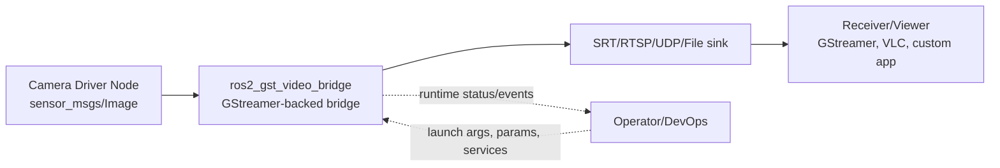
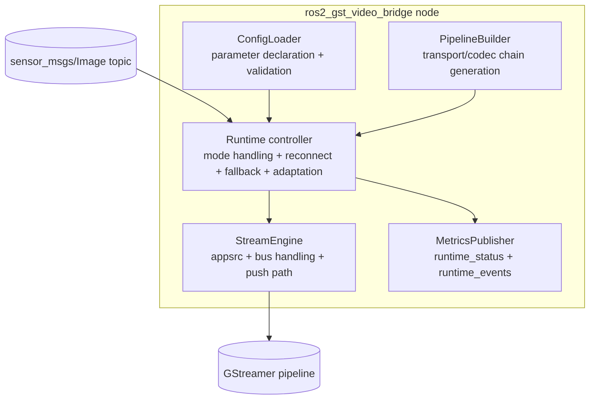
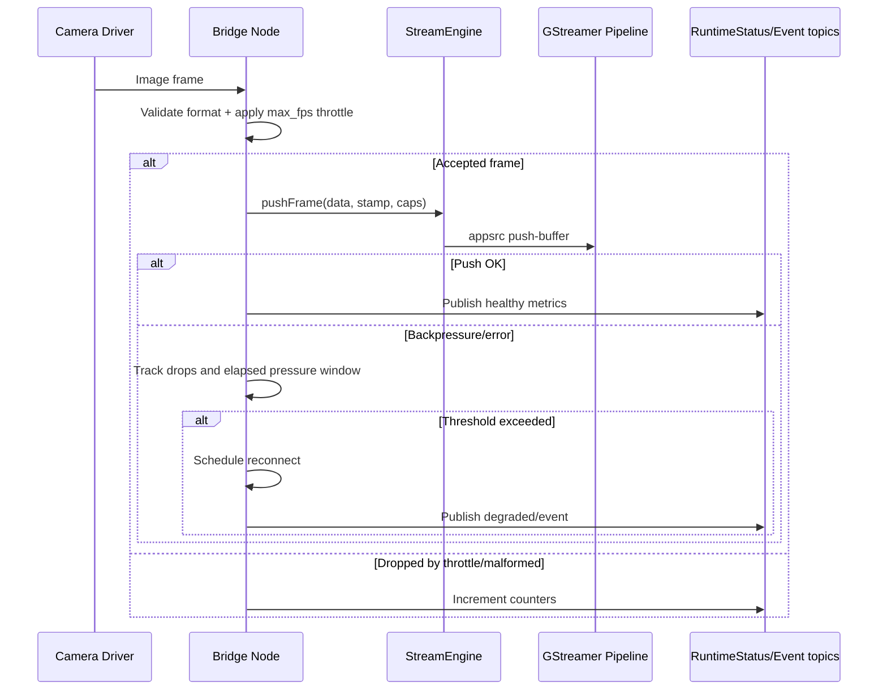
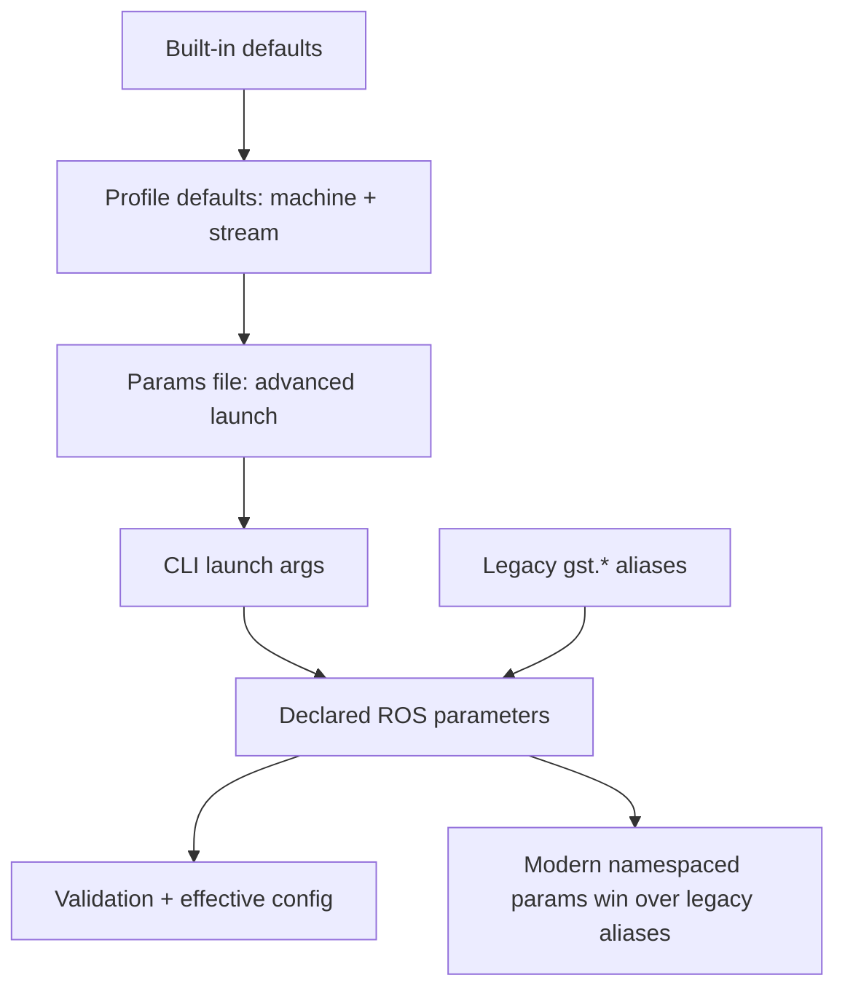

# Architecture

Owner: Mouhsine Kassimi Farhaoui <mouhsine98@gmail.com>
Last updated: 2026-04-28

## Purpose

This document explains how ros2_gst_video_bridge is structured, how frames move through the system, and how resilience logic keeps streaming alive under real-world instability.

## 1. System Context

The bridge sits between ROS image producers and network/media consumers. It decouples camera transport from downstream delivery by converting ROS image streams into configurable GStreamer pipelines.

Why this matters:
- Camera-side ROS concerns are isolated from transport/codec concerns.
- Output protocol can change without changing the camera stack.

## 2. Internal Component Architecture

Component responsibilities:
- ConfigLoader: resolves profile defaults, YAML/CLI overrides, and validates constraints.
- PipelineBuilder: creates transport/codec-specific GStreamer pipelines.
- StreamEngine: owns appsrc, caps updates, buffer push, and bus error processing.
- Runtime controller (node layer): throttling, backpressure policy, reconnect sequencing, and fallback decisions.
- MetricsPublisher: emits typed status/events plus compatibility metrics.

## 3. Runtime Data Flow

Design note:
- The max_fps limiter is implemented with token-bucket style behavior to tolerate normal input jitter while preserving an effective FPS ceiling.

## 4. Configuration Resolution Model

Resolution guarantees:
- Modern namespaced parameters override legacy aliases.
- Validation rejects impossible runtime settings early.
- Effective config is printable for diagnostics.

## 5. Reliability and Recovery Strategy

Primary mechanisms:
- Backpressure monitoring through consecutive-drop and elapsed-time thresholds.
- Controlled reconnect with configurable intervals and attempt limits.
- Hardware encoder fallback to software when repeated failures are observed.
- Adaptation profile logic (conservative/balanced/aggressive) for bitrate/FPS/GOP tuning.

Operational impact:
- Fewer hard failures in unstable links.
- Better continuity under temporary overload.
- Higher observability through typed runtime contract topics.

## 6. Contract Boundaries

- Public runtime contract: documented in CONTROL_PLANE.md.
- Public launch/parameter surface: documented in LAUNCH.md and README.md.
- Message and service schemas: ros2_gst_video_bridge_msgs package.

Any breaking changes to these boundaries must follow VERSIONING.md and CHANGELOG.md.

## 7. Source Layout (Implementation View)

- ros2_gst_video_bridge/include/ros2_gst_video_bridge/core: config and pipeline abstractions
- ros2_gst_video_bridge/include/ros2_gst_video_bridge/runtime: runtime helper components
- ros2_gst_video_bridge/src/node: runtime orchestration, lifecycle, recovery, observability
- ros2_gst_video_bridge/src/core: config loading and pipeline construction
- ros2_gst_video_bridge/src/runtime: streaming engine and support modules
- ros2_gst_video_bridge_msgs: typed runtime API surface

## 8. Non-Goals

- Not a camera driver replacement.
- Not a full media server.
- Not a persistent control-plane orchestrator.

It is a focused ROS-to-GStreamer streaming bridge with resilience features.
